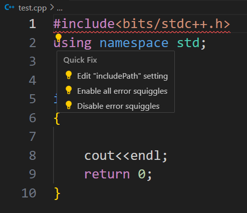
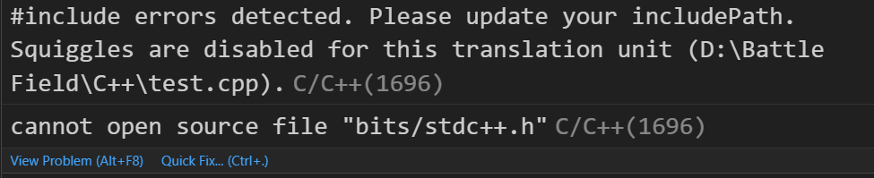
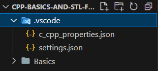

# CPP Basics and STL for CP

Here in this repo, you will find CPP basics and STL codes for beginners.
This repo will help the beginner(like me😁) to kick start there CP journey.

If like this repo, then make sure you give a star and fork it.

## Badges

[](https://choosealicense.com/licenses/mit/)
[](https://opensource.org/licenses/)
[](http://www.gnu.org/licenses/agpl-3.0)

## Prerequisites

- Install vs code.

- Install gcc/g++ compiler ie, *`MINGW-64`*

## Skeleton Code or The Basic Code for CP

```c++
#include<bits/stdc++.h>

int main()
{
    cout<<endl;
    return 0;
}
```
## `If by chance if you are getting any error like:- `


### `Then click on 'Edit.....' option`


### `you will get the .vscode folder`


### `open c_cpp_properties.json and paste the code. Save and run again`

```json
{
    "configurations": [
        {
            "name": "Win32",
            "includePath": [
                "C:\\MinGW\\include"
            ],
            "defines": [
                "_DEBUG",
                "UNICODE",
                "_UNICODE"
            ],
            "windowsSdkVersion": "10.0.19041.0",
            "compilerPath": "C:/MinGW/bin/g++.exe",
            "cStandard": "c17",
            "cppStandard": "c++17",
            "intelliSenseMode": "${default}"
        }
    ],
    "version": 4
}
```

## Thanks🤝🏻